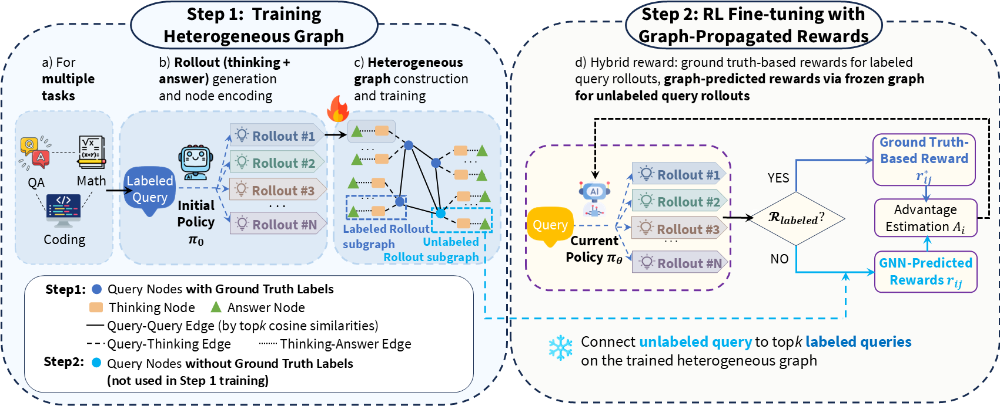
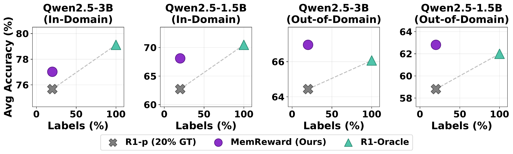
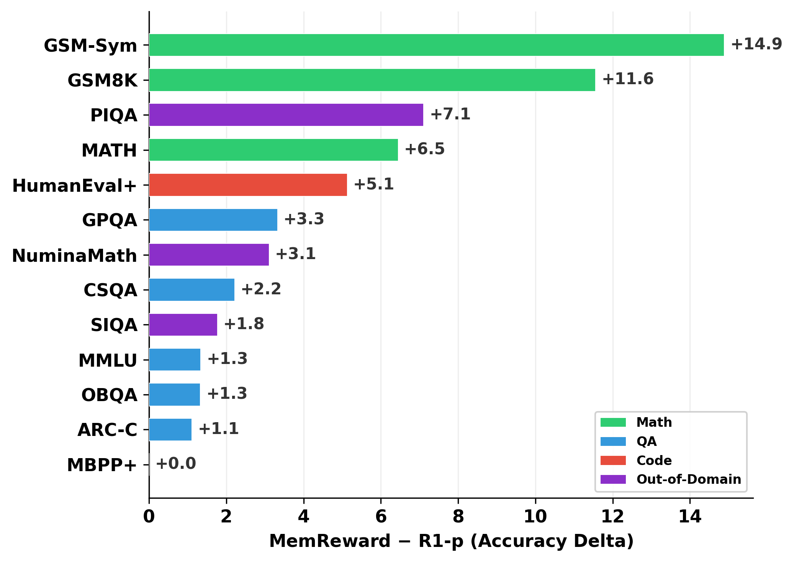
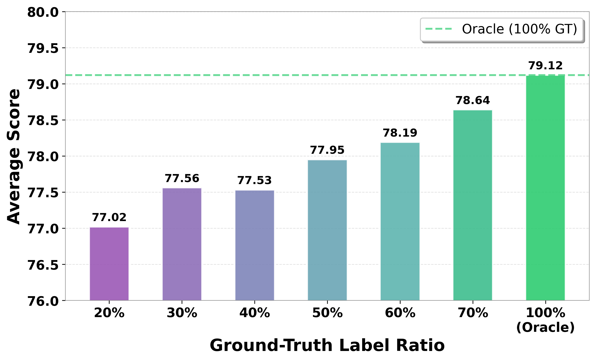
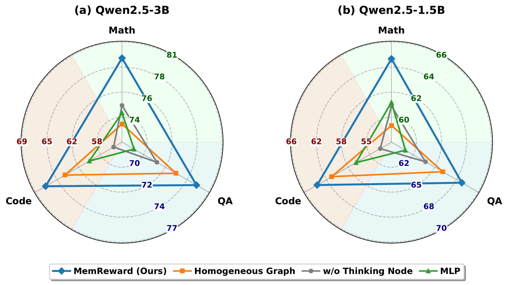

<h1 align="center">MemReward</h1>

<div align="center">
  <p>
    <a href="https://arxiv.org/abs/2603.19310"></a>
    <a href="https://huggingface.co/datasets/ulab-ai/memreward"></a>
    <a href="https://www.python.org/downloads/release/python-3120/"></a>
    <a href="https://github.com/ulab-uiuc/MemReward/pulls"></a>
  </p>
</div>


## 🔗 Links

- [Overview](#-overview) | [Method](#-method) | [Results](#-results)
- [Project Structure](#-project-structure) | [Environment Setup](#-preliminary)
- [Reproduce Paper Results](#-reproduce-paper-results) | [Train from Scratch](#-train-from-scratch)
- [Acknowledgement](#-acknowledgement) | [Citation](#-citation)


<!-- Overview Section -->
<h3 align="center">📌 Overview</h3>

<p align="center">
  MemReward is a graph-based experience memory framework for LLM reward prediction with limited labels. It covers 10 standard benchmarks across math (GSM8K, MATH, GSM-Symbolic), QA (MMLU, CommonsenseQA, OBQA, ARC-C, GPQA), and code (HumanEval+, MBPP+), plus 3 generalization domains (NuminaMath, PIQA, SIQA). With only 20% reward labels, MemReward achieves 97.3% of Oracle performance on Qwen-3B and 96.6% on Qwen-1.5B.
</p>

<!-- Method Section -->
<h3 align="center">🧠 Method</h3>

<p align="center">
  An initial LLM policy generates rollouts for each query, each comprising a thinking process and a final answer, and these rollouts are stored as experience memory. Queries, thinking processes, and answers form nodes in a heterogeneous graph with similarity and structural edges; a GNN trained on labeled nodes propagates rewards to unlabeled rollouts during online optimization.
</p>

<p align="center">
  
</p>


<!-- Results Section -->
<h3 align="center">📊 Results</h3>

<p align="center">
  <b>MemReward approaches Oracle performance with only 20% labels.</b>
</p>

<p align="center">
  
</p>

#### In-Domain Results (10 Benchmarks)

| **Method** | **GSM8K** | **GSM-Sym** | **MATH** | **MMLU** | **CSQA** | **OBQA** | **ARC-C** | **GPQA** | **HumanEval+** | **MBPP+** | **Avg** |
|:---|:---:|:---:|:---:|:---:|:---:|:---:|:---:|:---:|:---:|:---:|:---:|
| *Qwen2.5-3B-Instruct* | | | | | | | | | | | |
| R1-p (20% GT) | 92.89 | 84.67 | 54.67 | 71.78 | 77.33 | 78.44 | 80.00 | 21.67 | 64.10 | 65.00 | 75.67 |
| **MemReward (Ours)** | 92.89 | 86.44 | **61.11** | 72.00 | 74.44 | 81.78 | 80.44 | **30.00** | 61.54 | 63.75 | **77.02** |
| R1-Oracle (100% GT) | 92.89 | 90.22 | 60.33 | 72.22 | 79.11 | 83.11 | 84.00 | 30.00 | 71.79 | 73.75 | 79.12 |
| *Qwen2.5-1.5B-Instruct* | | | | | | | | | | | |
| R1-p (20% GT) | 77.11 | 62.89 | 44.44 | 53.33 | 70.22 | 68.67 | 71.56 | 20.00 | 38.46 | 55.00 | 62.72 |
| **MemReward (Ours)** | **88.67** | **77.78** | 50.89 | 54.67 | 72.44 | 70.00 | 72.67 | **23.33** | 43.59 | 55.00 | **68.10** |
| R1-Oracle (100% GT) | 86.44 | 75.33 | 53.11 | 66.44 | 74.44 | 74.00 | 74.89 | 15.00 | 53.85 | 56.25 | 70.47 |

#### Out-of-Domain Results (3 Benchmarks)

| **Method** | **NuminaMath** | **SIQA** | **PIQA** | **Avg** |
|:---|:---:|:---:|:---:|:---:|
| *Qwen2.5-3B-Instruct* | | | | |
| R1-p (20% GT) | 36.44 | 74.67 | 82.22 | 64.44 |
| **MemReward (Ours)** | **42.22** | **76.89** | 81.78 | **66.96** |
| R1-Oracle (100% GT) | 39.33 | 76.89 | 82.00 | 66.07 |
| *Qwen2.5-1.5B-Instruct* | | | | |
| R1-p (20% GT) | 31.56 | 72.67 | 72.22 | 58.81 |
| **MemReward (Ours)** | **34.67** | 74.44 | **79.33** | **62.81** |
| R1-Oracle (100% GT) | 32.00 | 74.89 | 79.11 | 62.00 |

> MemReward **surpasses Oracle** on out-of-domain tasks for both model scales, demonstrating that GNN-predicted rewards improve generalization beyond full supervision.

<table>
<tr>
<td align="center" width="55%"><b>MemReward consistently improves over R1-p across all 13 benchmarks on Qwen2.5-1.5B.</b></td>
<td align="center" width="45%"><b>MemReward performance scales with ground-truth label ratio on Qwen2.5-3B.</b></td>
</tr>
<tr>
<td align="center"></td>
<td align="center"></td>
</tr>
</table>

<p align="center">
  <b>Ablation studies on (a) Qwen2.5-3B and (b) Qwen2.5-1.5B show each architectural component contributes to performance.</b>
</p>

<p align="center">
  
</p>


## 📂 Project Structure

```
scripts/
├── Step1_llm_download/              # Download Qwen-3B and 1.5B models
├── Step2_original_data_download/    # Download 13 benchmark datasets
├── Step3_gnn_verl_data_preparation/ # Sample, generate responses, create VERL data
│   ├── sample_1500/                 #   Subsample 1500 queries per dataset
│   ├── generate_response/           #   Generate LLM rollouts with vLLM
│   ├── generate_and_verify_gt_identifier/  #   Create GT/GNN query routing configs
│   └── generate_verl_data/          #   Format data for VERL training (3 modes)
├── Step4_gnn_training_eval/         # Train and evaluate GNN reward models
├── Step5_verl_training/             # GRPO training scripts
│   ├── qwen2.5-3b/                  #   8 standard + 3 generalization configs
│   └── qwen2.5-1.5b/               #   3 standard + 3 generalization configs
└── Step6_verl_evaluation/           # Merge FSDP checkpoints and evaluate

src/reward_graph/
├── rewards/                         # GT and GNN reward functions for VERL
│   └── utils/                       #   GNN model architecture and multi-domain scoring
├── heterogeneous_gnn/               # Heterogeneous graph construction and GNN training strategies
└── utils/                           # Embedding cache management and merging
```


## 📌 Preliminary

### Environment Setup

```shell
# Create virtual environment
python3.12 -m venv /path/to/venv
source /path/to/venv/bin/activate

# Install PyTorch 2.9.0 with CUDA 12.8
pip install torch==2.9.0 torchvision==0.24.0 torchaudio==2.9.0 \
    --index-url https://download.pytorch.org/whl/cu128

# Install VERL from source
cd /tmp
git clone https://github.com/volcengine/verl.git
cd verl
git checkout 3b1c139607f377f599b60792fa51a54d7bc42897
pip install -e .

# Install remaining packages
pip install -r environment_installation/requirements.txt

# Install the project package
cd src && pip install -e . && cd ..

# Verify installation
python -c "import torch, verl, vllm; print(f'PyTorch: {torch.__version__}, CUDA: {torch.version.cuda}')"
```


## 🔄 Reproduce Paper Results

Download the complete project (code, data, and trained checkpoints) directly from [HuggingFace](https://huggingface.co/datasets/ulab-ai/memreward):

### Step 1: Download from HuggingFace

```bash
# Install git-lfs if needed
git lfs install

# Clone the complete repository
git clone https://huggingface.co/datasets/ulab-ai/memreward
cd memreward
```

The repository contains everything needed for reproduction:

| Folder | Contents | Size |
|--------|----------|------|
| `configs/` | GT identifier JSONs for query routing (20%-70% ratios) | 212K |
| `data/` | Sampled datasets, VERL-formatted training data, generalization data | 56M |
| `outputs/` | GNN embeddings + trained VERL checkpoints (Qwen-3B and Qwen-1.5B) | ~93G |
| `scripts/` | Full pipeline scripts (data prep, GNN training, VERL training, evaluation) | — |
| `src/` | Core reward_graph library | — |

### Step 2: Setup Environment and Download LLMs

```bash
# Setup environment (see Preliminary section above)

# Download LLMs
python scripts/Step1_llm_download/download_models.py
```

This downloads `Qwen2.5-3B-Instruct` and `Qwen2.5-1.5B-Instruct` to `llm/`.

### Step 3: Evaluate

```bash
# Evaluate Qwen-3B MemReward (20% GT + 80% GNN) on standard benchmarks
python scripts/Step6_verl_evaluation/merge_and_evaluate_detailed.py \
    --find_best outputs/qwen2.5-3b/verl_grpo_20gt_80gnn_dot_product_hard --gpu 0

# Evaluate on generalization benchmarks
python scripts/Step6_verl_evaluation/merge_and_evaluate_detailed.py \
    --find_best outputs/qwen2.5-3b/verl_grpo_generalization_20gt_80gnn_dot_product \
    --dataset_type generalization --gpu 0
```


## ⭐ Train from Scratch

> **Tip:** We recommend downloading `configs/` and `data/` from [HuggingFace](https://huggingface.co/datasets/ulab-ai/memreward) to ensure consistent data splits and GT routing configurations for stable reproduction.

### Step 1: Download LLMs and Datasets

```shell
# Download LLMs (Qwen2.5-3B-Instruct, Qwen2.5-1.5B-Instruct)
python scripts/Step1_llm_download/download_models.py

# Download all 13 datasets (10 standard + 3 generalization)
bash scripts/Step2_original_data_download/download_all.sh
```

### Step 2: Data Preparation

```shell
# Full data preparation pipeline (sample → responses → GT identifiers → VERL data)
bash scripts/Step3_gnn_verl_data_preparation/run_standard_pipeline.sh --gpus 0,1,2,3
bash scripts/Step3_gnn_verl_data_preparation/run_generalization_pipeline.sh --gpus 0,1,2
```

### Step 3: GNN Training

```bash
bash scripts/Step4_gnn_training_eval/train_gnn_best_of_n_dotproduct.sh \
    --model-type qwen3b --hard-label --gpus 0,1,2,3 --num-runs 40
```

### Step 4: VERL Training

GRPO training scripts are in `scripts/Step5_verl_training/`, organized by model size:

```bash
# Baseline: 100% ground-truth reward
nohup bash scripts/Step5_verl_training/qwen2.5-3b/verl_grpo_100perc_gt.sh \
    > outputs/qwen2.5-3b/verl_grpo_100perc_gt/training.log 2>&1 &

# Sparse baseline: 20% GT only
nohup bash scripts/Step5_verl_training/qwen2.5-3b/verl_grpo_20perc_gt_only.sh \
    > outputs/qwen2.5-3b/verl_grpo_20perc_gt_only/training.log 2>&1 &

# MemReward: 20% GT + 80% GNN
nohup bash scripts/Step5_verl_training/qwen2.5-3b/verl_grpo_20gt_80gnn_dot_product.sh \
    > outputs/qwen2.5-3b/verl_grpo_20gt_80gnn_dot_product_hard/training.log 2>&1 &
```

Additional GT/GNN ratio variants (30/70, 40/60, 50/50, 60/40, 70/30) and generalization scripts are also available. See `scripts/Step5_verl_training/README.md` for the full list.

### Step 5: Evaluation

Merge FSDP checkpoints and evaluate on all test benchmarks:

```bash
# Auto-find best checkpoint, merge, and evaluate
python scripts/Step6_verl_evaluation/merge_and_evaluate_detailed.py \
    --find_best outputs/qwen2.5-3b/verl_grpo_20gt_80gnn_dot_product_hard --gpu 0

# Evaluate on generalization benchmarks
python scripts/Step6_verl_evaluation/merge_and_evaluate_detailed.py \
    --find_best outputs/qwen2.5-3b/verl_grpo_generalization_20gt_80gnn_dot_product \
    --dataset_type generalization --gpu 0
```


## 🔧 Advanced Configuration

> **Tip:** The codebase supports optional answer-level features (e.g., answer consensus across rollouts) that can be configured per domain via `answer_feat_dim` in `src/reward_graph/rewards/utils/gnn_models.py`.


## 📝 Acknowledgement

The implementation of **MemReward** is built upon [VERL](https://github.com/volcengine/verl), [vLLM](https://github.com/vllm-project/vllm), [PyTorch Geometric](https://github.com/pyg-team/pytorch_geometric), and [Qwen](https://github.com/QwenLM/Qwen2.5).

We sincerely appreciate the efforts of these teams for their contributions to open-source research and development.


## 🤝 Contribution

We welcome contributions from the community! If you find bugs, have feature requests, or want to improve MemReward, please open an issue or submit a pull request.

<div align="center">
  <a href="https://github.com/ulab-uiuc/MemReward/graphs/contributors">
    
  </a>
</div>


## Star History

<div align="center">
  <a href="https://star-history.com/#ulab-uiuc/MemReward&Date">
    <picture>
      <source media="(prefers-color-scheme: dark)" srcset="https://api.star-history.com/svg?repos=ulab-uiuc/MemReward&type=Date&theme=dark" />
      <source media="(prefers-color-scheme: light)" srcset="https://api.star-history.com/svg?repos=ulab-uiuc/MemReward&type=Date" />
      
    </picture>
  </a>
</div>


## 📚 Citation

If you find MemReward useful, please cite our paper:

```bibtex
@misc{luo2026memrewardgraphbasedexperiencememory,
      title={MemReward: Graph-Based Experience Memory for LLM Reward Prediction with Limited Labels},
      author={Tianyang Luo and Tao Feng and Zhigang Hua and Yan Xie and Shuang Yang and Ge Liu and Jiaxuan You},
      year={2026},
      eprint={2603.19310},
      archivePrefix={arXiv},
      primaryClass={cs.LG},
      url={https://arxiv.org/abs/2603.19310},
}
```
